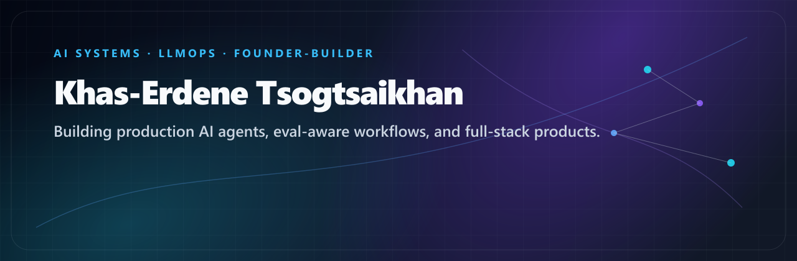
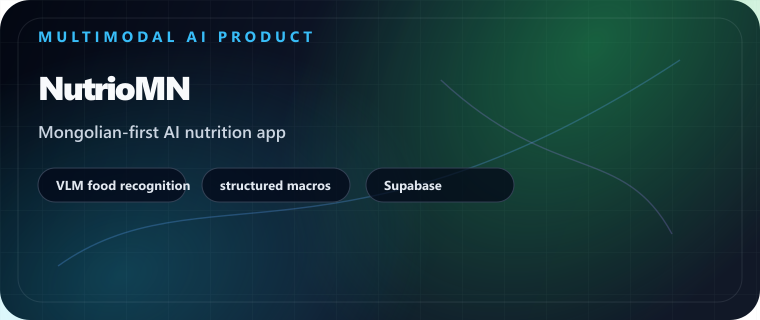
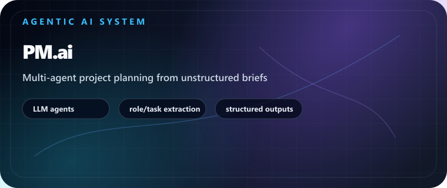
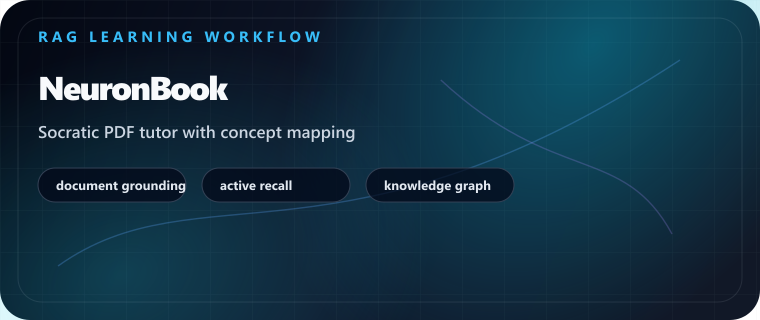
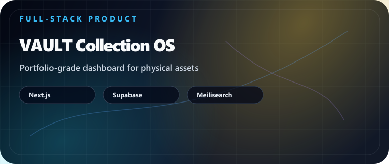

<p align="center">
  
</p>

<p align="center">
  
</p>

<p align="center">
  <a href="https://github.com/Khas-Erdene-Tsogtsaikhan/Next.js-Developer-Portfolio-Starter-Code">
    
  </a>
  <a href="https://www.linkedin.com/in/khas-erdene-tsogtsaikhan/">
    
  </a>
  <a href="mailto:khaserdene_ts@berkeley.edu">
    
  </a>
  <a href="https://github.com/Khas-Erdene-Tsogtsaikhan">
    
  </a>
</p>

## About

I build production AI products and the systems that make them reliable: agentic workflows, RAG pipelines, tool-calling systems, structured outputs, backend APIs, multimodal products, and evaluation-aware deployment loops.

My work sits at the intersection of AI engineering, product execution, and startup operations. I like taking an ambiguous problem from brief → architecture → working product → measurable user outcome.

```text
AI systems / LLMOps      Agent orchestration       RAG + tool calling
Structured outputs       Evaluation workflows      Multimodal AI
Python / TypeScript      FastAPI / Node.js          React / Next.js
React Native             Supabase / Firebase        Product engineering
```

## Selected systems

<table>
  <tr>
    <td width="50%" valign="top">
      <a href="https://apps.apple.com/my/app/nutriomn/id6759483173">
        
      </a>
      <h3>NutrioMN</h3>
      <p>
        Multimodal AI nutrition product for Mongolian foods. Uses vision-language
        recognition, structured calorie/macro outputs, validation-oriented backend
        flows, and a mobile product loop designed for real users rather than a model demo.
      </p>
      <p><code>VLM</code> <code>structured outputs</code> <code>FastAPI</code> <code>Supabase</code></p>
    </td>
    <td width="50%" valign="top">
      <a href="https://devpost.com/software/pm-ai">
        
      </a>
      <h3>PM.ai</h3>
      <p>
        Agentic project-management system that turns unstructured briefs into
        validated tasks, roles, dependencies, and execution plans through coordinated
        LLM agents and structured output contracts.
      </p>
      <p><code>multi-agent</code> <code>LLM workflows</code> <code>structured planning</code></p>
    </td>
  </tr>
  <tr>
    <td width="50%" valign="top">
      <a href="https://devpost.com/software/neuronbook">
        
      </a>
      <h3>NeuronBook</h3>
      <p>
        Document-grounded AI learning system that transforms PDFs into Socratic
        tutoring, active-recall prompts, concept relationships, and personalized study
        loops using retrieval-aware LLM interactions.
      </p>
      <p><code>RAG</code> <code>PDF grounding</code> <code>Socratic agent</code> <code>React</code></p>
    </td>
    <td width="50%" valign="top">
      <a href="https://vaultcollection.org">
        
      </a>
      <h3>VAULT Collection OS</h3>
      <p>
        Full-stack portfolio system for physical assets: valuation context, documents,
        collection analytics, market lookup, scheduled data refreshes, and a premium
        product interface.
      </p>
      <p><code>Next.js</code> <code>Supabase</code> <code>Meilisearch</code> <code>data workflows</code></p>
    </td>
  </tr>
</table>

## Additional work

- **[CourseLynx](https://chromewebstore.google.com/detail/courselynx/jlkkmogoppoeklmphegjnapbahappopj?hl=en)** — AI-assisted course discovery and recommendation infrastructure with tool-driven retrieval, university data ingestion, and a Chrome extension workflow.
- **[Google Ads Transparency Monitor](https://apify.com/opalescent_bird/google-ads-transparency-monitor)** — Apify-based competitor intelligence pipeline with delta detection, webhook alerts, scheduled data extraction, and LLM-ready outputs.

## Engineering approach

- Design the workflow and failure modes before polishing the model demo.
- Use structured outputs and validation boundaries so AI behavior is inspectable.
- Treat retrieval quality, tool correctness, tracing, latency, and product UX as one system.
- Document architecture, ownership, tradeoffs, setup, and future improvements.
- Build toward real usage: distribution, reliability, business constraints, and feedback loops.

## Open to

AI systems, LLMOps, backend, full-stack product, and founder-engineer roles where I can ship reliable AI software with an ambitious team.
